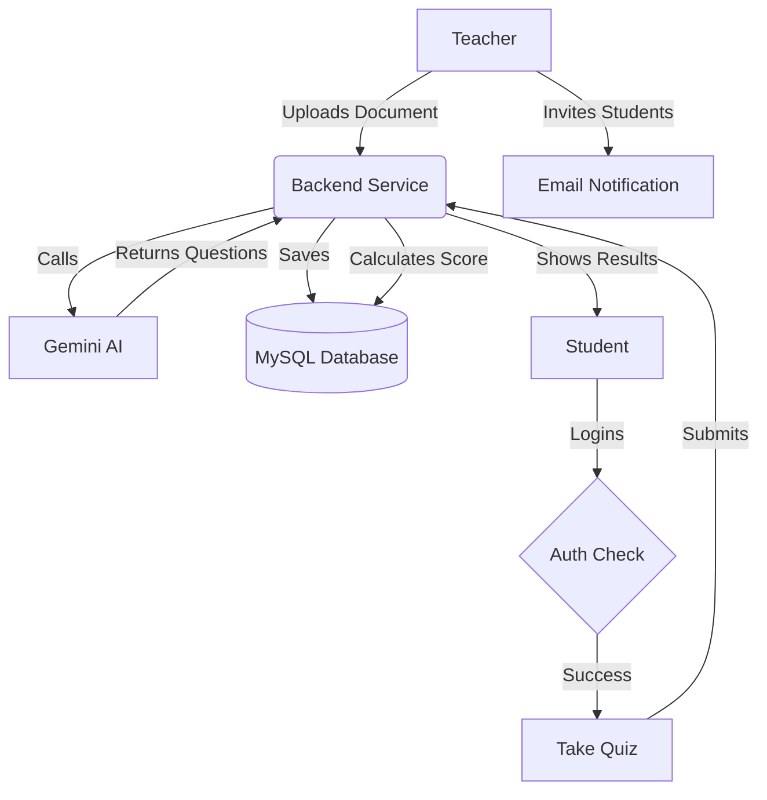

# 🏗️ System Architecture

## Overview
Examme is built on a **Monolithic Architecture** using the **Spring Boot** framework. It follows a layered design pattern to ensure separation of concerns and maintainability.

### Layered Structure
1. **Controller Layer**: Handles HTTP requests and maps them to service methods.
2. **Service Layer**: Contains business logic, AI integration (Gemini), and orchestration.
3. **Repository Layer**: Manages data persistence using Spring Data JPA.
4. **Security Layer**: Implements JWT-based stateless authentication.

---

## 🔄 User Flow & System Workflow

The following diagram illustrates the primary workflow for creating and taking an exam.

---

## 🔐 Security Architecture

The system uses a stateless security model:
- **JWT (JSON Web Token)**: Used for session management.
- **Refresh Tokens**: Stored in the database to allow secure session renewal.
- **Role-Based Access Control (RBAC)**: Distinct permissions for `TEACHER`, `STUDENT`, and `ADMIN`.

---
[Return to README](../README.md) | [Back to Top](#system-architecture)
