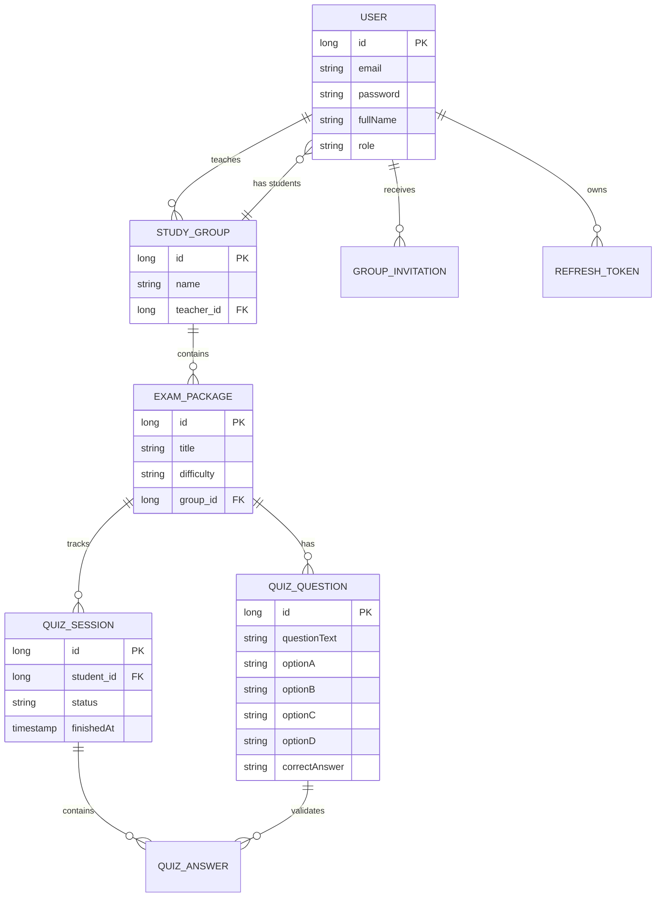

# 🗄️ Database Schema

## Entity Relationship Diagram (ERD)

The following diagram defines the relationships between core entities in the Examme system.

## Data Dictionary

### Core Tables

| Table | Purpose | Key Relationships |
| :--- | :--- | :--- |
| `users` | Stores credentials and roles. | Central to all activity. |
| `study_groups` | Groups created by teachers. | Linked to `users` (Teacher/Student). |
| `exam_packages` | Collections of questions for a group. | Linked to `study_groups`. |
| `quiz_questions` | Individual AI-generated questions. | Linked to `exam_packages`. |
| `quiz_sessions` | Tracks student attempts. | Linked to `users` and `exam_packages`. |

---
[Return to README](../README.md) | [Back to Top](#database-schema)
